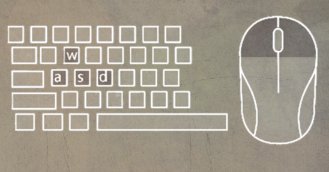
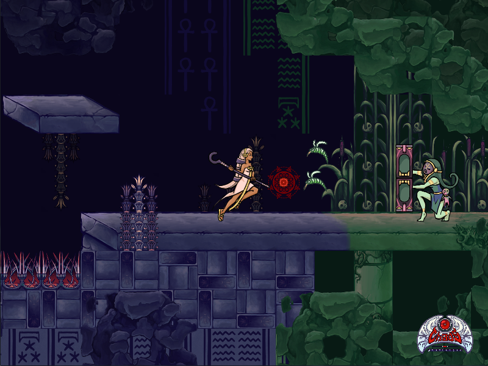
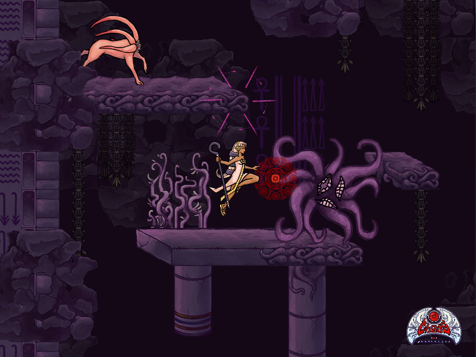

 Chaos Projectile - Run 'n' Gun meets RPG
==========================================

Synopsis
--------

Chaos Projectile is an open source 2-dimensional action arcade game with
role-playing elements, currently in development.


The game is set in the run’n’gun genre but there will also be character
development system with which the character can gain additional attributes
or actions permanently over the course of the game. Every level
has multiple exits. Dependent on what exit the player chooses, different
character attributes get changed or actions unlocked. The setting is inspired
after ancient Egypt. Visual elements of the Art Nouveau era are present, as well
as influences from the Cthulhu cult by Lovecraft.

Controlls
--------



On game start a control settings screen is shown. It is possible to customize
game actions and play the game with connected gamepad. Make sure the
gamepad is connected and on before starting the game otherwise the game
can't identify the gamepad. *Sometimes it takes a second till the imput is
reassigned.* ESC key exits the game and ENTER key is for pause. BACKSPACE
resets/reloads the game.

**Control suggestions:**
* Default (are shown on image above):
  - *aim*: mouse move
  - *attack*: mouseclick
  - *movement*: A W D keys
  - in settings screen toggle "use default settings"
* Game pad with double joysticks:
  - *aim* and *attack*: one stick
  - *movement*: other stick
  - in settings screen assign stick tilts to every player action
* Game pad with hat:
  - *aim* and *attack*: one hat
  - *movement*: same hat
  - in settings screen toggle "use hat to move" and "use hat to aim" with the same hat

Run the game
--------
Please note the [release](https://github.com/WinterLicht/Chaos-Projectile/releases)
button.
There you can find executables for Linux and Windows. The game must not
be installed. Simply unpack the .zip and run the executable. Linux users should make
the file "Chaos-Projectile" executable. For that you can use the following command
`chmod +x Chaos-Projectile` and start the game with `./Chaos-Projectile`.
To uninstall just delete the directory.

Used libraries
--------
- pygame:  http://www.pygame.org/news.html
- PyTMX:  https://github.com/bitcraft/pytmx
- pyscroll:  https://github.com/bitcraft/pyscroll
- uses and contains FreeSans font

Compiling from source
--------
After pulling the repository, you can *run* the game using the following commands:

```
apt-get install python-pygame python-pip 
pip install pytmx pyscroll
cd src
python game.py
```

Or *compile* the game with:

```
python setup.py build
```

As the game was mainly developed on Debian-like systems, those commands
assume Python and apt-get to be available. If you run the game on non-Debian
operating system, you won't be able to run the first command. Thus, you
will need to install [pygame](https://pygame.org/download.shtml)
(used library) and [pip](https://pypi.python.org/pypi/pip/)
(installer for the pytmx and pyscroll) from other sources.



Developers
--------
- Code by Anna Dorokhova is licensed under [GNU GPLv3](http://www.gnu.org/licenses/gpl-3.0.html)
- 2D game art assets by Anna Dorokhova are licensed under [CC-BY 4.0](https://creativecommons.org/licenses/by/4.0/)
- Leveldesign and balancing by Maik Helfrich [GNU GPLv3](http://www.gnu.org/licenses/gpl-3.0.html)



