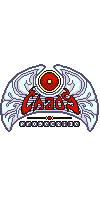

==========================================
 Chaos Projectile - Run 'n' Gun meets RPG
==========================================

:Version: 0.0.1
:Web [EN]: https://enchaosprojectile.wordpress.com/
:Web [DE]: https://chaosprojectile.wordpress.com/
:Keywords: game, python, pygame, arcade

--

.. contents::
    :local:

.. _chaosprojectile-synopsis:

Synopsis
========

Chaos Projectile is an open source 2-dimensional action arcade game with
role-playing elements.

The game is set in the run’n’gun genre but there will also be character
development system with which the character can gain additional attri-
butes or actions permanently over the course of the game. Every level
has multiple exits. Dependent on what exit the player chooses, different
character attributes get changed or actions unlocked. The gaphic style
is set in pixel art and the setting takes place in ancient Egypt. Visual
elements ot the Art Nouveau era are present, as well as influences from
the Cthulhu cult by Lovecraft.

.. _chaosprojectile-facts:

Facts about the game
====================

Hier muss Uebersicht ueber die Architektur hin!

    +-------------------+----------------------------------------------+
    | Genre             | Run 'n' Gun + RPG elements                   |
    +-------------------+----------------------------------------------+
    | Setting           | Ancient Egypt + Cthulhu-Myth + Art Nouveau   |
    +-------------------+----------------------------------------------+
    | Art Style         | Hand-drawn digital                           |
    +-------------------+----------------------------------------------+
    | Platform          | PC                                           |
    +-------------------+----------------------------------------------+
    | Players           | 1                                            |
    +-------------------+----------------------------------------------+
    | Target group      | Coregamer                                    |
    +-------------------+----------------------------------------------+
    | Programming       | Python with PyGame                           |
    | language and used | (+ additional Python libraries)              |
    | libraries         |                                              |
    +-------------------+----------------------------------------------+

.. _license:

License
=======

.. |CC-BY-NC-SA 4.0| replace:: *CC-BY-NC-SA 4.0*
.. _CC-BY-NC-SA 4.0: http://creativecommons.org/licenses/by-nc-sa/4.0/

The source code is licensed under the GNU General Public License v.3
(See gpl-3.0.txt).
All 2D game art assets by Anna Dorokhova under the |CC-BY-NC-SA 4.0|_

(Licensing for .tmx-levels and sound files coming soon!)

.. # vim: syntax=rst expandtab tabstop=4 shiftwidth=4 shiftround

